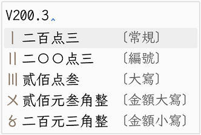
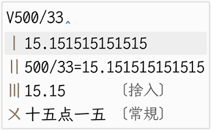
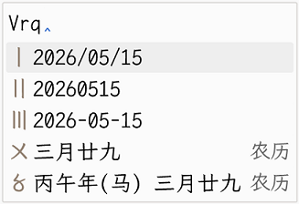
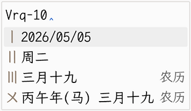

# 雜然

## 简介：

自然码双拼+魔然字词/拆字+万象模型

## 大致说明
本方案仅基于本人对一次输入即正确结果需求所改    
主要的输入方式是 字词挂接、句中辅整句
主要核心为`pseudo_moran.lua`、`moran_reorder_filter.lua`、`moran_pin.lua`  
可以移除`zaran.custom.yaml`抛弃辅助功能，纯打字

以魔然方案的挂接打法为主，为引用较高整句准确率的万象词库，需要基于不含自造词的纯净词库与模型。所以分别用两个翻译器：一个是无自造词的“固词翻译器”，另一个是支持词频动态调整的“frequency翻译器”。以上与原有的字词翻译器“fixed”一同由 `pseudo_moran.lua` 处理，以提升候选词首次命中的概率。

> [!TIP]
> 魔然官网：[魔然官网](https://moran.rimeinn.org/zh-Hans/book/usage/features.html)

本方案内kagiroi是缩减版，只保留`romaji`功能

## 快符
本方案快符引导为后置触发，快符引导为`/`键

| 输出 | 输入 | 记忆点      |
| ---- | ---- | ----------- |
| '    | a/   | 无序_冒号   |
| ·    | j/   | j_间隔号    |
| _    | x/   | x_下划线    |
| ……   | s/   | s_省略号    |
| .    | d/   | d_点        |
| ——   | h/   | h_横线      |
| “    | q/   | 无序_左冒号 |
| ”    | w/   | 无序_右冒号 |
| 『   | u/   | 无序_角引号 |
| 』   | i/   | 无序_角引号 |
##  混合V键
| 功能       | 引导                                                    | 演示                                 |
| ---------- | ------------------------------------------------------- | ------------------------------------ |
| 大写数字   | `V`+任意数字                                            |          |
| 简易计算器 | `V`+算式                                                |      |
| 日期输入   | `V`+`sj`→时间<br>`V`+`rq`→日期<br>`V`+`xq`or`week`→星期 |            |
| 日期偏移   | `V`+`rq`+`±`+`任意整数`                                 |  |

## 快捷键
| 功能               | 引导                                   |
| ------------------ | -------------------------------------- |
| `Ctrl+s`           | 用字标准                               |
| `Ctrl+u`           | 声调提示                               |
| `Ctrl+g`           | 字集过滤切换                           |
| `Ctrl+Shift+G`     | 固词模式                               |
| `Ctrl+b`           | 额外comment提示（拆字、翻译）          |
| `Ctrl+i`           | 切分轮换                               |
| `Ctrl+i`or`Ctrl+o` | 快速取回辅助码                         |
| `Ctrl+Shift+space` | 切换输入法（`zaran`与`kagiroi`间切换） |
| `ok`               | `kagiroi`反查                          |
| `olf`              | 两分与笔画反查                         |

## 移除功能或模块
### 移除kagiroi相关的部件

```yaml
# 用户文件夹移除以下的部件
./kagiroi_romaji.schema.yaml   
./kagiroi.custom.yaml  
./kagiroi.dict.yaml  
./kagiroi.schema.yaml  
./kagiroi.yaml  
./kagiroi_kanji.dict.yaml  
./kagiroi_kanji.schema.yaml  
./kagiroi_romaji.dict.yaml  

# default.yaml下移除
schema_list:
  - schema: kagiroi

# zaran.custom.yaml下移除
engine/processors/@before 2: lua_processor@*kagiroi/kagiroi_kana_speller  
engine/segmentors/@before 3: affix_segmentor@kagiroi  
engine/translators/+:
- lua_translator@*kagiroi/kagiroi_translator
engine/filters/@before 1: lua_filter@*kagiroi/kagiroi_aux_filter@reverse
```
## 平台支持：

小狼毫weasel

## 感谢：
魔然：[rime-moran](https://moran.rimeinn.org/)  
万象词库：[RIME-LMDG](https://github.com/amzxyz/RIME-LMDG)  
kagiroi：[rime-kagiroi](https://github.com/rimeinn/rime-kagiroi)  
成对符号：[rime-paired-punct](https://github.com/pfeiwu/rime-paired-punct)   
Rime agent：[agent-skills](https://github.com/rimeinn/agent-skills)   
感谢 @XiHanQWQ 关于lua方面的解惑与修改  